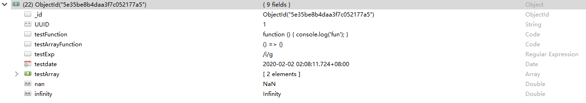
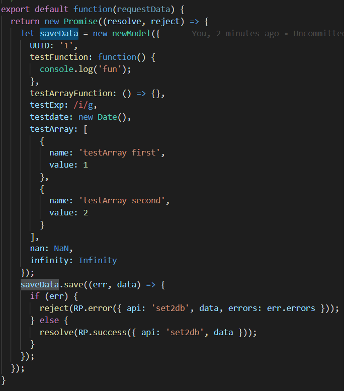
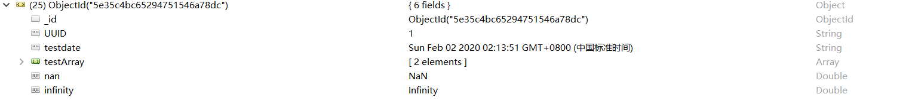
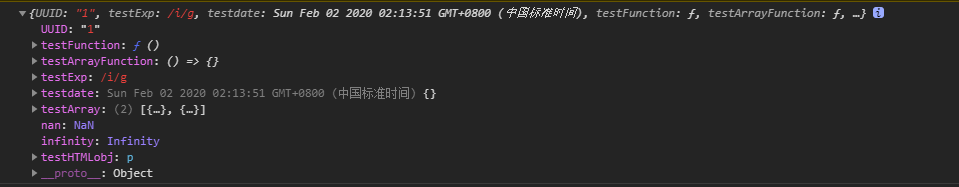
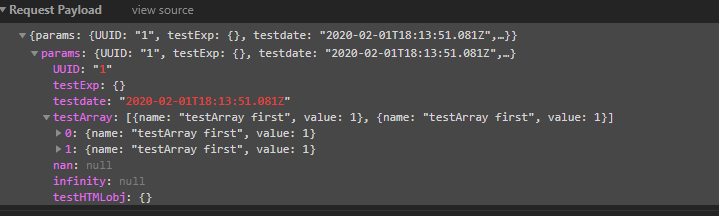

# start-nodejs-mongodb

## 背景
随着redux以及其他前端状态管理的兴起。前端有大量的object,json需要管理、存储。对object或json进行序列化、反序列化本身就是一个较大的开销而且不安全(object内部的函数字段、Infinity字段等。序列化时都会出问题或需要特殊处理)。并且序列化后不能对内部的字段进行单独处理。采用noSql的形式直接存储json或object对象或许是一个比较好的解决方案。该项目尝试去解决json或object的存储、自由修改问题。

## 要实现复杂对象存储、修改所遇见的坑

目前所遇到的坑

0. 数据库是否支持多属性字段
    
    数据库本身是支持Code Reg Date 以及 NaN Infinitely 存储的

1. 数据库到后端的通讯 复杂对象如何传递
    
    以nodejs比较易上手的`mongoose`库为例
    后端API调用
    
    

    数据库接收

    
    
    这里仍然丢失了`Code` 和 `Reg` 字段


2. 前端到后端通讯 复杂对象如何传递

    常规前端到后端通讯方案基于Http协议, 通常`Headers`的`Content-Type`属性值为`application/json;charset=UTF-8`,`Accept`的值为`application/json, text/plain, */*`协议本身是基于json的,导致在前端向后端发送请求时有部分隐式转换导致类型发生变化,下图以一个`post`请求为例

    原对象：
    
    
    
    发送的对象：

    

    这里前端发送的请求就已经出错

3. 前端复杂对象的显示问题

    目前通用的解决方案仍然是将复杂对象转化为String类型用于显示，而且貌似没有功能完善，十分健壮的第三方库用于对象与String类型转化

## 安装
+ mongodb(数据库)
+ Robo 3T(mongodb 的可视化管理工具)
+ nodejs(本项目前端后端均采用nodejs生态)

## 启动

+ in back-end
```shell
yarn install
yarn start
```

+ in front-end
```shell
yarn install
yarn start
```

## 安装启动流程
1. 安装相关软件(见[#安装]())
2. mongodb 设置用户名和密码


## 问题解决
HTML文档

function

object

object更新

循环引用

无限 & NaN


## 参考 & 引用
https://blog.csdn.net/qq_33206732/article/details/79877948

https://www.runoob.com/mongodb/mongodb-tutorial.html

https://www.cnblogs.com/pl-boke/p/10063351.html

https://www.runoob.com/mongodb/mongodb-databases-documents-collections.html

http://www.mongoosejs.net/docs/index.html

http://www.mongoosejs.net/docs/guide.html